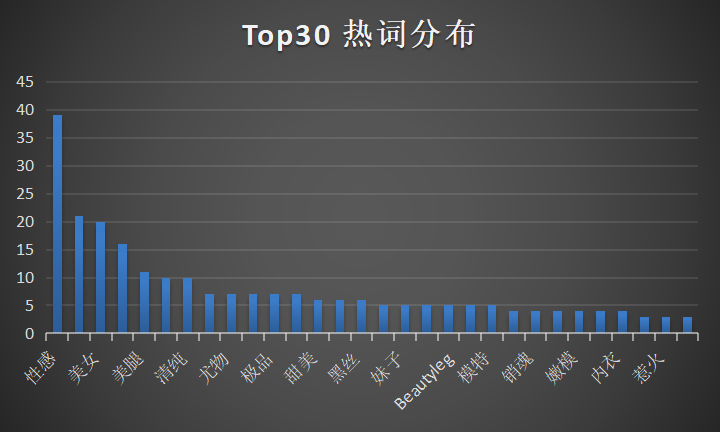
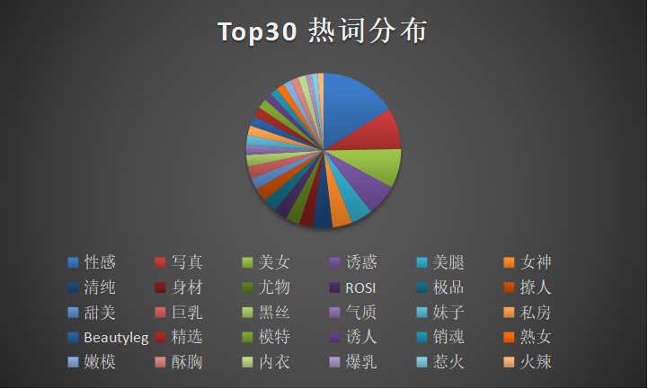

## 原作README：<https://github.com/chenjiandongx/mzitu>

## 词频统计
> 只是重新实现了爬虫并重新计算的数据，仅作练习使用，请勿与原版进行非技术性对比

热词Top30分布

  
  

热词Top100生成词云

  

## 胸围统计
> 网站上并未直接提供该，通过专辑标题中的关键字来计算各单位数量，并生成图表

实际分析了专辑名称，发现样本太少（大部分并不含罩杯信息），，所以沿用原作者的结果，以下是原作者的分析结果

然后我又统计了代表着妹子胸围的 **字母** 生成了条形图

**G** 真的是一柱擎天，**E** 和 **F** 排在第二梯队。我们再来看看**胸围**的百分比情况  

  

G 的比例是最大的，高达 **42%**，E 加上 F 也基本上有半壁江山了

